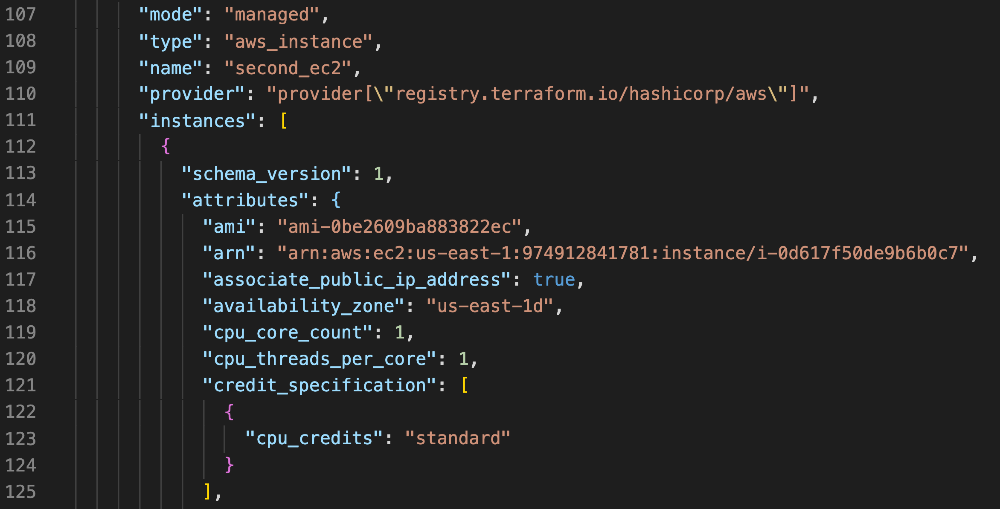
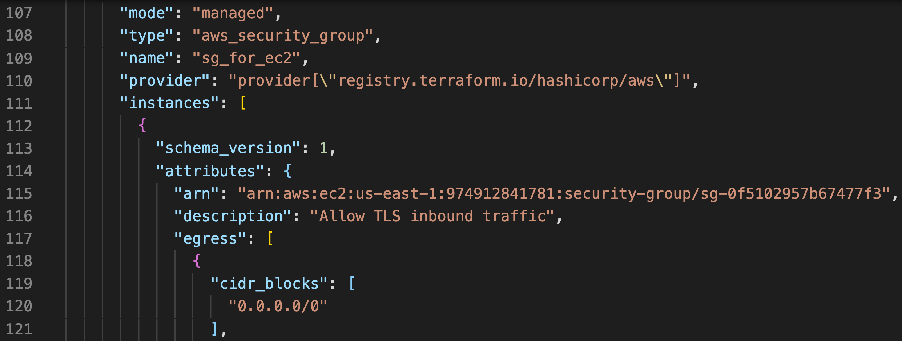
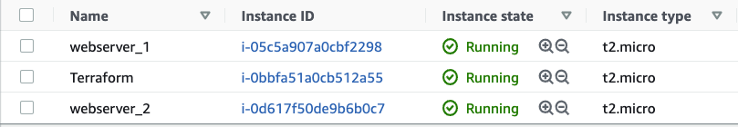
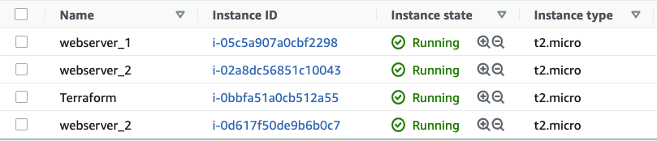
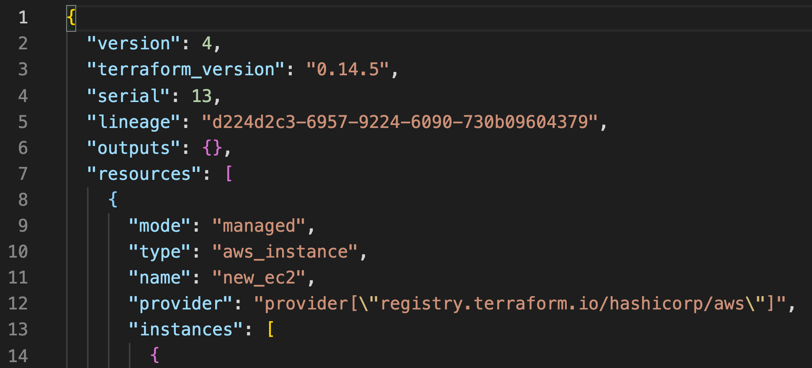

# Managing terraform state file. Terraform state subcommands.

### Resources:

- Terraform version 0.14
- AWS account

## Description

Terraform has lots of commands which you want to be familiar with if you want to use Terraform, and detailed description is given in the next link [alphabetical list of commands](https://www.terraform.io/docs/cli/commands/import.html)

But when you work with Terraform state file there's a specific list of subcommands that you can see after running `terraform state` command that you can use with terraform state. The Terraform state subcommands all work with remote state just as if it was local state. This command has subcommands for advanced state management. These subcommands can be used to slice and dice the Terraform state. This is sometimes necessary in advanced cases. For your safety, allstate management commands that modify the state create a timestamped backup of the state prior to making modifications.

```
Subcommands:
    list                List resources in the state
    mv                  Move an item in the state
    pull                Pull current state and output to stdout
    push                Update remote state from a local state file
    replace-provider    Replace provider in the state
    rm                  Remove instances from the state
    show                Show a resource in the state
```

[`terraform state list`](https://www.terraform.io/docs/cli/commands/state/list.html) - is a command which lists all the resources (types of resources) and their names, that was created and currently sitting in state file. Output from this command will be like this, in my case I have two instances and security group:

```
aws_instance.first_ec2
aws_instance.second_ec2
aws_security_group.sg_for_ec2
```

If you would like to see detailed information about particular resource [`terraform state show`](https://www.terraform.io/docs/cli/commands/state/show.html) is the command, in my case I'm pulling info about my ec2 instance.

```
terraform state show aws_instance.second_ec2  (resource type and name)
```
As you see here in addition to `terraform state show` I'm giving also `resource type.resource name` as it shown above and I'm getting the next output:

```
# aws_instance.second_ec2:
resource "aws_instance" "second_ec2" {
    ami                          = "ami-0be2609ba883822ec"
    arn                          = "arn:aws:ec2:us-east-1:974912841781:instance/i-0d617f50de9b6b0c7"
    associate_public_ip_address  = true
    availability_zone            = "us-east-1d"
    cpu_core_count               = 1
    cpu_threads_per_core         = 1
    disable_api_termination      = false
    ebs_optimized                = false
    get_password_data            = false
    hibernation                  = false
    id                           = "i-0d617f50de9b6b0c7"
    instance_state               = "running"
    instance_type                = "t2.micro"
    ipv6_address_count           = 0
    ipv6_addresses               = []
    monitoring                   = false
    primary_network_interface_id = "eni-03d0ba050c812f890"
    private_dns                  = "ip-172-31-91-109.ec2.internal"
    private_ip                   = "172.31.91.109"
    public_dns                   = "ec2-54-84-53-33.compute-1.amazonaws.com"
    public_ip                    = "54.84.53.33"
    secondary_private_ips        = []
    security_groups              = [
        "allow_22_80",
    ]
    source_dest_check            = true
    subnet_id                    = "subnet-ebc366ca"
    tags                         = {
        "Environment" = "dev"
        "Name"        = "webserver_2"
    }
    tenancy                      = "default"
    vpc_security_group_ids       = [
        "sg-0f5102957b67477f3",
    ]

    credit_specification {
        cpu_credits = "standard"
    }

    enclave_options {
        enabled = false
    }

    metadata_options {
        http_endpoint               = "enabled"
        http_put_response_hop_limit = 1
        http_tokens                 = "optional"
    }

    root_block_device {
        delete_on_termination = true
        device_name           = "/dev/xvda"
        encrypted             = false
        iops                  = 100
        tags                  = {}
        throughput            = 0
        volume_id             = "vol-0c74da5c4f8f1dacd"
        volume_size           = 8
        volume_type           = "gp2"
    }
}
```

The next command is not the terraform state subcommand but it's very useful for managing state file in terraform, [`terraform taint`](https://www.terraform.io/docs/cli/commands/taint.html) is a command that will `taint` or `untaint` the resources in my case an `instance` that is in state file. This command manually marks a Terraform-managed resource as tainted, forcing it to be destroyed and recreated on the next apply. This command will not modify infrastructure, but does modify the state file in order to mark a resource as tainted. Generally if we run,

```
terraform tain aws_instance.second_ec2
``` 

output from this command will be:

```
Resource instance aws_instance.second_ec2 has been marked as tainted.
```

After that we run `terraform plan` it will show that our `second_ec2` instance will be destroyed and a new instance will be created.

```
An execution plan has been generated and is shown below.
Resource actions are indicated with the following symbols:
-/+ destroy and then create replacement

Terraform will perform the following actions:

  # aws_instance.second_ec2 is tainted, so must be replaced
-/+ resource "aws_instance" "second_ec2" {
      ~ arn                          = "arn:aws:ec2:us-east-1:974912841781:instance/i-0d617f50de9b6b0c7" -> (known after apply)
      ....................

Plan: 1 to add, 0 to change, 1 to destroy.      
```

But we can easily untain the resource by running,

```
terraform untaint aws_instance.second_ec2
```

Output from the command:
```
Resource instance aws_instance.second_ec2 has been successfully untainted.
```

and if we run `terraform plan` again it will show the next output:

```
No changes. Infrastructure is up-to-date.

This means that Terraform did not detect any differences between your configuration and real physical resources that exist. As a result, no actions need to be performed.
```

The next command is [`terraform state rm`](https://www.terraform.io/docs/cli/commands/state/rm.html) it works the same way as the other terraform state subcommands, which are refering to the objects (resources) in the state file.

Before we run command below terraform state file contains seconc_ec2:



Then we run terraform state rm command which will remove second_ec2.

```
terraform state rm aws_instance.second_ec2
```

After running command above `second_ec2` instance will be deleted from the state file and output from that command will look like this:

```
Removed aws_instance.second_ec2
Successfully removed 1 resource instance(s).
```

You can check the content of the state file by running `terraform state list` command:

```
aws_instance.first_ec2
aws_security_group.sg_for_ec2
```

Terraform state file after removing second_ec2, as you can see that instead of second ec2 we have description of security group now:



But terraform has no idea that second_ec2 instance was ever created, is not physically destroyed from AWS, we can see it on AWS console:



But if we run `terraform plan` it will say that new instance will be created as it is shown in our configurations file (template). So that `second_ec2` instance which terraform is not aware of will be still up and running, always run command `terraform plan` to make sure what changes terraform  will make. 
```
An execution plan has been generated and is shown below.
Resource actions are indicated with the following symbols:
  + create

Terraform will perform the following actions:

  # aws_instance.second_ec2 will be created
  + resource "aws_instance" "second_ec2" {
      + ami                          = "ami-0be2609ba883822ec"
      ........
  Plan: 1 to add, 0 to change, 0 to destroy.     
```

When you run terraform apply it will create another instance with the same name, but be careful with s3 bucket name, you will get an error because you can't create s3 bucket with the same name on AWS (the name has to be unique).



There are various used cases for removing items from a Terraform state file. The most common is refactoring a configuration to no longer manage that resource (perhaps moving it to another Terraform configuration/state).

The next command is [`terraform state mv`](https://www.terraform.io/docs/cli/commands/state/mv.html), what it does is moves one resource to another. Before you do anything run command terraform state list you should get the following output:

```
aws_instance.first_ec2
aws_security_group.sg_for_ec2
```

After that run command terraform state mv:

```
terraform state mv aws_instance.first_ec2 aws_instance.new_ec2
```

Ouput from this command:

```
Move "aws_instance.first_ec2" to "aws_instance.new_ec2"
Successfully moved 1 object(s).
```

And now when we run terraform state list again we will get this output:

```
aws_instance.new_ec2
aws_security_group.sg_for_ec2
```
terraform state file:



Since both resources (instances) have the same configurations terraform just renamed the `aws_instance.first_ec2` to `aws_instance.new_ec2`. That is how we move one resource to another using terraform state mv.

The [`terraform state pull`](https://www.terraform.io/docs/cli/commands/state/pull.html) command is used to manually download and output the state from remote state. This command also works with local state. `terraform state pull` command will output the content of your state file. This is useful for reading values out of state (potentially pairing this command with something like jq). It is also useful if you need to make manual modifications to state.

The [`terraform state push`](https://www.terraform.io/docs/cli/commands/state/push.html) command is used to manually upload a local state file to remote state. This command also works with local state. This command should rarely be used. It is meant only as a utility in case manual intervention is necessary with the remote state. This command will push the state specified by PATH to the currently configured backend. Usage:

```
terraform state push [options] PATH
```

The [`terraform state replace-provider`](https://www.terraform.io/docs/cli/commands/state/replace-provider.html) command is used to replace the provider for resources in a Terraform state. This command will update all resources using the "from" provider, setting the provider to the specified "to" provider. This allows changing the source of a provider which currently has resources in state. This command will output a backup copy of the state prior to saving any changes. The backup cannot be disabled. Due to the destructive nature of this command, backups are required. Usage: 

```
terraform state replace-provider [options] FROM_PROVIDER_FQN TO_PROVIDER_FQN
```

The next command is [`terraform refresh`](https://www.terraform.io/docs/cli/commands/refresh.html) this command will compare the state file and the infrastructure in real world and can detect if there any changes were done. This command does not modify infrastructure, but does modifies the state file. If state file is changed it will occure in the next `terraform apply`.

[`terraform validate`](https://www.terraform.io/docs/cli/commands/validate.html) will go and check your configurations and makes sure it's valid, if not it gives an error by saying this part of your configurtion file wasn't configured right, it checks whether a configuration is syntactically valid and internally consistent. It is a good practice to run this command to check while you are writing your code, really helpful terraform command, takes just a few seconds to run. 

[`terraform fmt`](https://www.terraform.io/docs/cli/commands/fmt.html) command will will make sure your code (configurations) are well formated by hashi corp standards.

[`terraform import`](https://www.terraform.io/docs/cli/commands/import.html) will import existing resources into terraform.To copy a module you need to run the next command:
```
terraform import module.my-ec2.aws_instance.ec2-instance i-0a0c9cd872cb1a200. # module.modules_name.resource_type.resource_name followed by resource ID
```
To import an ec2 it will look like this:
```
terraform import aws_instance.my-ec2 i-0a0c9cd872cb1a200 # resource_type.resource_name followed by resource ID.
```
For the s3 bucket it looks like this"
```
terraform import aws_s3_bucket.bucket bucket-name
```